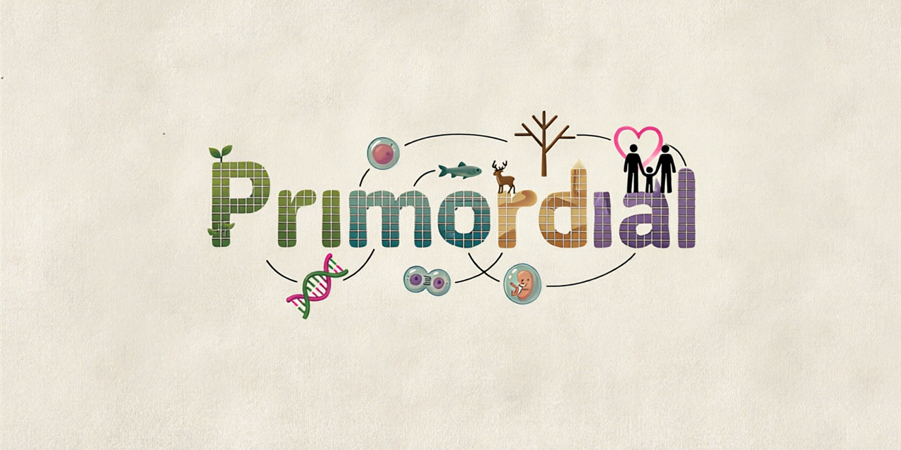

<div align="center">



**Multi-agent simulation engine with emergent genetics, ecological relationships, and natural evolution**

[](https://opensource.org/licenses/MIT)
[](https://www.python.org/downloads/)
[]()
[](CONTRIBUTING.md)

</div>

---

# 🌍 Primordial

**Primordial** es un motor de simulación multi-agente que modela ecosistemas complejos con genética emergente, relaciones ecológicas, comportamiento social y evolución natural. El objetivo final es crear una **aplicación completa con interfaz gráfica** que cualquier usuario pueda instalar y usar sin conocimientos de programación.

<div align="center">


</div>

---

## 📋 Descripción

Este proyecto simula un mundo virtual donde organismos con genomas únicos interactúan, compiten, se reproducen y evolucionan de forma completamente autónoma. A diferencia de simulaciones con reglas fijas de "quién come a quién", aquí **las relaciones ecológicas emergen** de la combinación de perfil biológico, rasgos genéticos y condiciones ambientales.

Cada organismo tiene un genoma único con más de 20 rasgos heredables que determinan su comportamiento, capacidades y relaciones con otras especies. El resultado es un ecosistema vivo que evoluciona de forma impredecible.

### 🎯 Filosofía

> *"Las relaciones ecológicas son OBJETOS, no reglas fijas. Emergen de la combinación de perfil + genoma + entorno."*

### 🎮 Visión del proyecto

El objetivo final es crear **Primordial** como una **aplicación de escritorio completa** con interfaz gráfica desarrollada en Godot donde el usuario pueda:

- **Crear mundos a medida** desde la interfaz: mapa, biomas, especies y genomas iniciales
- Observar la simulación en tiempo real con representación visual 2D
- **Modificar cualquier variable del mundo en plena simulación**: probabilidad de embarazo, edad máxima, radios de detección, tasas de mutación...
- Guardar y cargar estados del mundo
- Exportar estadísticas y métricas
- Instalar como aplicación independiente sin necesidad de Python

Actualmente el **motor de simulación está completamente funcional** y la interfaz gráfica está en desarrollo activo.

---

## 👤 Tu rol: arquitecto de mundos

En **Primordial** el usuario no es un espectador: es el **arquitecto del mundo**. La experiencia tiene dos momentos:

### 🌍 1. Creación del mundo

Antes de encender la simulación, tú defines las condiciones iniciales del universo que quieres observar:

- **El escenario**: tamaño del mapa, biomas, clima y estaciones
- **Los habitantes**: especies iniciales, poblaciones, perfiles biológicos y genomas
- **Las reglas del juego**: fertilidad, longevidad, metabolismos, radios de detección, probabilidad de mutación...

Puedes partir de un escenario predefinido o diseñar tu propio mundo desde cero.

### 🎛️ 2. Intervención durante la simulación

Con el mundo ya en marcha, puedes **modificar cualquier variable en tiempo real**, sin pausar ni reiniciar:

| Variable ajustable (ejemplos) | Qué ocurre al tocarla |
|-------------------------------|------------------------|
| Probabilidad de embarazo | Explosión o colapso demográfico |
| Edad máxima de una especie | Cambia el relevo generacional y el ritmo evolutivo |
| Radio de detección de enemigos | Huidas más eficaces... o más estrés crónico |
| Tasa de mutación | Evolución acelerada o estancamiento |
| Metabolismo y coste energético | Ecosistemas más o menos exigentes |
| Frecuencia de catástrofes | Pone a prueba la resiliencia del ecosistema |

### 🔬 Experimentar → observar → comprender

Cada cambio que haces se convierte en un **experimento vivo**: modificas un parámetro, observas cómo responde el ecosistema a lo largo de las generaciones y descubres qué equilibrios emergen. Primordial es a la vez **juguete, laboratorio y microscopio** de vida artificial.

> *"Tú pones las reglas. La vida hace el resto."*

---

## ✨ ¿Qué puede hacer la simulación?

### 🧬 Genética y Evolución

| Característica | Descripción |
|----------------|-------------|
| **Genomas universales** | Cada organismo tiene 20+ rasgos heredables |
| **Rasgos heredables** | Velocidad, fuerza, inteligencia, tamaño, metabolismo, sociabilidad, longevidad, fertilidad, inmunidad, instinto depredador, capacidad de defensa |
| **Mutaciones** | Cada reproducción puede generar mutaciones genéticas |
| **Evolución emergente** | Las poblaciones se adaptan naturalmente sin intervención |
| **Herencia mendeliana** | Los rasgos se combinan de ambos padres |

### 🌿 Ecología y Relaciones entre Especies

La simulación modela **8 tipos de relaciones ecológicas** que emergen automáticamente:

| Relación | Especie A | Especie B | Ejemplo |
|----------|-----------|-----------|---------|
| 🐺 **Depredación** | Se alimenta | Muere | Lobo → Ciervo |
| 🌱 **Herbivoría** | Come plantas | Dañada | Conejo → Hierba |
| 🤝 **Mutualismo** | Se beneficia | Se beneficia | Abeja + Flor |
| ⚔️ **Competencia** | Pierde | Pierde | León vs Hiena |
| 🦠 **Parasitismo** | Vive a expensas | Dañada | Pulga → Perro |
| 🏠 **Comensalismo** | Se beneficia | No afectada | Cangrejo + Anémona |
| 💀 **Amensalismo** | No afectada | Perjudicada | Elefante + Hormigas |
| ➖ **Neutralismo** | Sin efecto | Sin efecto | Especies distantes |

**12 mecanismos de interacción** ejecutan estas relaciones:

| Mecanismo | Descripción | Estado |
|-----------|-------------|--------|
| 🎯 **Hunt** | Caza activa con persecución | ✅ |
| 🐺 **Pack Hunting** | Caza coordinada en manada | ✅ |
| 🌿 **Grazing** | Pastoreo de vegetación | ✅ |
| 🌸 **Pollination** | Polinización mutualista | ✅ |
| 🌰 **Seed Dispersal** | Dispersión de semillas | ✅ |
| 🍖 **Scavenging** | Carroñeo | ✅ |
| 🦠 **Infection** | Infección parasitaria | ✅ |
| ⚔️ **Resource Consumption** | Competencia por recursos | ✅ |
| 🏳️ **Territorial Display** | Exhibición territorial | 🚧 |
| 🕳️ **Ambush** | Emboscada sigilosa | 🚧 |
| 🧪 **Chemical Suppression** | Alelopatía | 🚧 |
| 🌊 **Filter Feeding** | Filtrado de agua | 🚧 |

### ⚡ Sistema de Energía

Cada organismo gestiona su energía de forma realista:

| Proceso | Descripción |
|---------|-------------|
| 🌞 **Fotosíntesis** | Las plantas generan energía del sol |
| 🔥 **Metabolismo** | Consumo constante de energía por vivir |
| 🏃 **Movimiento** | Gasto energético al desplazarse |
| 💔 **Estrés** | El estrés consume energía |
| 🤒 **Enfermedad** | Las enfermedades drenan energía |
| 💀 **Inanición** | Muerte por falta de energía |

### 🐾 Comportamiento Inteligente

| Capacidad | Descripción |
|-----------|-------------|
| 👁️ **Detección de amenazas** | Las presas detectan depredadores cercanos y huyen |
| 🎯 **Detección de presas** | Los carnívoros buscan presas activamente |
| 🌿 **Detección de vegetación** | Los herbívoros buscan plantas para comer |
| 🧠 **Toma de decisiones** | Los organismos evalúan opciones y eligen acciones |
| 💾 **Memoria** | Recuerdan experiencias pasadas |
| 🎓 **Aprendizaje** | Mejoran su comportamiento con la experiencia |

### 🏃 Movimiento y Espacio

| Característica | Descripción |
|----------------|-------------|
| 🗺️ **Mapa de tiles** | Mundo dividido en celdas con biomas |
| 🏞️ **Biomas** | Bosques, praderas, desiertos, océanos, montañas |
| 📍 **SpatialGrid** | Búsquedas espaciales optimizadas O(1) |
| 🚶 **Pathfinding** | Movimiento inteligente hacia objetivos |
| 🌍 **Migración** | Movimientos masivos estacionales |

### 👥 Relaciones Sociales

| Sistema | Descripción |
|---------|-------------|
| 🤝 **Relaciones interpersonales** | Amistad, enemistad, romance |
| ❤️ **Matrimonio** | Formación de parejas |
| 💔 **Divorcio** | Ruptura de relaciones |
| 👶 **Familia** | Padres, hijos, hermanos |
| 🏠 **Adopción** | Reestructuración familiar |
| 📜 **Genealogía** | Árbol familiar completo con linajes |

### 🌡️ Ambiente Dinámico

| Característica | Descripción |
|----------------|-------------|
| 🍂 **Estaciones** | Primavera, verano, otoño, invierno |
| 🌍 **Biomas dinámicos** | Los biomas afectan las relaciones ecológicas |
| 🌪️ **Catástrofes** | Terremotos, incendios, inundaciones, sequías |
| 🦠 **Epidemiología** | Enfermedades contagiosas con patógenos |
| 💊 **Inmunología** | Sistema inmunológico con resistencia |

### 📊 Métricas y Análisis

La simulación recolecta métricas multidimensionales automáticamente:

| Categoría | Métricas |
|-----------|----------|
| 👥 **Población** | Total, nacimientos, muertes, crecimiento |
| 🎂 **Edad** | Estructura por edades, edad promedio |
| 🧬 **Genética** | Promedios de rasgos, diversidad genética |
| 🦠 **Epidemiología** | Infecciones activas, familias de patógenos |
| 🌿 **Ecología** | Encuentros, depredaciones, herbivoría, mutualismo, competencia |
| 👶 **Reproducción** | Embarazos activos, fertilidad |
| 🧠 **Cognición** | Estrés, felicidad, energía promedio |
| 👥 **Social** | Matrimonios, solteros, huérfanos |
| 🗺️ **Espacial** | Presión por sectores, hacinamiento |
| 📜 **Genealogía** | Linajes activos/extintos, generaciones |

---

## 🚀 Instalación y Uso (Modo Consola)

> **Nota**: Actualmente la simulación se ejecuta por consola. La interfaz gráfica está en desarrollo.

### Requisitos

- Python 3.13 o superior
- pip

### Instalación

```bash
# Clonar el repositorio
git clone https://github.com/primordial-sim/primordial.git
cd primordial

# Crear entorno virtual
python -m venv venv

# Activar entorno virtual (Windows)
venv\Scripts\activate

# Activar entorno virtual (Linux/Mac)
source venv/bin/activate

# Instalar dependencias
pip install -e .
```

### Ejecución

```bash
# Ejecución básica
python launcher.py

# Con parámetros
python launcher.py --population 100 --width 50 --height 50 --ticks 1000
```

### Parámetros disponibles

| Parámetro | Alias | Descripción | Por defecto |
|-----------|-------|-------------|-------------|
| `--config` | `-c` | Ruta al archivo de configuración | `config.yaml` |
| `--population` | `-p` | Población inicial | `50` |
| `--width` | `-w` | Ancho del mundo en tiles | `30` |
| `--height` | `-H` | Alto del mundo en tiles | `30` |
| `--ticks` | `-t` | Número de ticks a simular | `100` |
| `--seed` | `-s` | Semilla aleatoria (reproducibilidad) | Aleatorio |
| `--export` | `-e` | Ruta para exportar métricas | `metrics.json` |
| `--no-export` | — | Desactivar exportación | — |
| `--snapshot-interval` | — | Intervalo de snapshots en días | `1` |
| `--verbose` | `-v` | Logging detallado | — |
| `--quiet` | `-q` | Solo eventos relevantes | — |

### Ejemplos

```bash
# Simulación rápida con 200 organismos
python launcher.py -p 200 -t 500

# Simulación reproducible con semilla
python launcher.py -s 12345 -p 100

# Simulación grande (500 organismos, mundo 100x100)
python launcher.py -p 500 -w 100 -H 100 -t 2000

# Modo silencioso (solo nacimientos, muertes, matrimonios)
python launcher.py -q

# Exportar métricas a archivo específico
python launcher.py -p 150 -e resultados/mi_simulacion.json
```

---

## 🧪 Testing

El proyecto cuenta con **372 tests** organizados en tres niveles:

| Tipo | Descripción | Cantidad |
|------|-------------|----------|
| 🟢 **Unitarios** | Tests de componentes individuales | ~350 |
| 🟡 **Integración** | Tests de interacción entre sistemas | ~15 |
| 🔵 **Benchmarks** | Tests de rendimiento | ~7 |

```bash
# Ejecutar todos los tests
python -m pytest tests/ --tb=short -q

# Ejecutar solo tests unitarios
python -m pytest tests/unit/ -v

# Ejecutar con cobertura
python -m pytest tests/ --cov=systems --cov-report=html

# Ejecutar tests específicos de ecología
python -m pytest tests/unit/test_ecological_mechanisms.py -v
```

---

## 📁 Estructura del proyecto

```
primordial/
├── launcher.py              # Punto de entrada (modo consola)
├── pyproject.toml           # Configuración del proyecto
├── pytest.ini               # Configuración de tests
│
├── core/                    # Núcleo del motor
│   ├── engine/              # Motor de simulación, fases, scheduler
│   ├── genetics/            # Sistema genético universal
│   ├── taxonomy/            # Clasificación de especies
│   ├── state/               # Estado del mundo y buffer transaccional
│   └── config/              # Configuración y parámetros
│
├── systems/                 # Sistemas de simulación (16 módulos)
│   ├── ecology/             # Relaciones ecológicas y mecanismos
│   ├── energy/              # Sistema de energía
│   ├── movement/            # Movimiento, migración, pathfinding
│   ├── relationships/       # Relaciones sociales, matrimonio
│   ├── reproduction/        # Reproducción, gestación, huevos
│   ├── mortality/           # Mortalidad, envejecimiento
│   ├── diseases/            # Epidemiología, patógenos
│   ├── environment/         # Biomas, estaciones, catástrofes
│   ├── metrics/             # Recolección de métricas
│   ├── evolution/           # Motor evolutivo
│   ├── genealogy/           # Genealogía y linajes
│   └── ...                  # Más sistemas
│
├── entities/                # Entidades del mundo
│   └── person/              # Organismos (clase Person)
│
├── tests/                   # Suite de tests (372 tests)
│   ├── unit/                # Tests unitarios
│   ├── integration/         # Tests de integración
│   └── benchmarks/          # Tests de rendimiento
│
├── docs/                    # Documentación técnica
│   ├── 00_INDICE.md         # Índice de documentación
│   ├── systems/             # Documentación por sistema
│   ├── planning/            # Planificación y roadmap
│   ├── specs/               # Especificaciones
│   └── assets/              # Imágenes y recursos del README
│
├── godot/                   # Frontend visual (Godot) - En desarrollo
├── scenarios/               # Escenarios predefinidos
├── data/                    # Datos generados (no versionado)
└── tools/                   # Utilidades y scripts
```

---

## 🏗️ Arquitectura del Motor

El motor opera en un **ciclo de fases secuenciales** que se ejecutan en cada tick:

```
┌─────────────────────────────────────────────────────────────┐
│                    CICLO DE SIMULACIÓN                      │
└─────────────────────────────────────────────────────────────┘

1. ⏰ Temporal      → Relojes internos, envejecimiento
2. 🌍 Ambiental     → Biomas, estaciones, presión social
3. 🌿 Ecológica     → Relaciones entre especies, energía
4. 👥 Social        → Relaciones, matrimonios, adopciones
5. 🚶 Movimiento    → Migración, desplazamiento
6. 💊 Salud         → Enfermedades, inmunología
7. 👶 Reproducción  → Concepción, gestación, nacimiento
8. 💀 Mortalidad    → Curvas de supervivencia, muerte
9. 📊 Observadores  → Métricas, genealogía, evolución
```

### Flujo de datos

```
┌──────────────┐     ┌─────────────────┐     ┌──────────────┐
│  WorldState  │────▶│  PendingChanges │────▶│   Commit     │
│  (Estado)    │     │  (Buffer)       │     │  (Aplicar)   │
└──────────────┘     └─────────────────┘     └──────────────┘
      │                     │                     │
      ▼                     ▼                     ▼
 Lectura de             Modificaciones       Estado final
 estado actual          pendientes           consolidado
```

---

## 🛣️ Roadmap

### ✅ Completado

- [x] Sistema genético universal con 20+ rasgos
- [x] Inferencia automática de relaciones ecológicas
- [x] 8 tipos de relaciones ecológicas
- [x] 8 mecanismos de interacción implementados
- [x] Sistema de energía completo
- [x] Detección ecológica de amenazas/presas/vegetación
- [x] Optimización espacial con SpatialGrid O(1)
- [x] Métricas multidimensionales (incluyendo ecología)
- [x] Genealogía completa con linajes
- [x] Sistema de matrimonios y adopciones
- [x] Epidemiología con patógenos
- [x] Catástrofes naturales
- [x] 372 tests pasando
- [x] Profesionalización del repositorio (licencia, guías de comunidad, plantillas)

### 🚧 En progreso

- [ ] Interfaz gráfica en Godot
- [ ] Editor de mundos y panel de control de parámetros en vivo
- [ ] Mecanismos adicionales (emboscada, caza en manada, territorial)
- [ ] Integración InfectionMechanism ↔ DiseaseSystem
- [ ] Empaquetado como aplicación instalable

### 🔮 Futuro

- [ ] Especiación por aislamiento ecológico
- [ ] Coevolución depredador-presa
- [ ] Extinciones y eventos cascada
- [ ] API web para visualización remota
- [ ] Editor de escenarios visual avanzado
- [ ] Modo sandbox con control directo de organismos

---

## 🖥️ Interfaz Gráfica (En Desarrollo)

La aplicación final incluirá una interfaz gráfica desarrollada en **Godot 4.x**:

**Características planificadas**:
- **Editor de mundos**: diseño del mapa, biomas y poblaciones iniciales antes de simular
- Visualización en tiempo real del mundo con tiles y organismos
- **Panel de control en vivo**: modificación de cualquier parámetro (reproducción, longevidad, detección, mutaciones...) sin reiniciar la simulación
- Panel de estadísticas poblacionales
- Control de velocidad de simulación (play, pause, fast-forward)
- Inspección de organismos individuales (genoma, energía, relaciones)
- Gráficos de evolución y métricas
- Guardar/cargar estados del mundo
- Exportación de reportes

---

## 📚 Documentación

La documentación técnica completa está en [`docs/`](docs/):

| Documento | Descripción |
|-----------|-------------|
| [`00_INDICE.md`](docs/00_INDICE.md) | Índice maestro de documentación |
| [`01_FUNDAMENTOS.md`](docs/01_FUNDAMENTOS.md) | Arquitectura del motor |
| [`20_ECOLOGIA.md`](docs/systems/20_ECOLOGIA.md) | Sistema de relaciones ecológicas |
| [`21_ENERGIA.md`](docs/systems/21_ENERGIA.md) | Sistema de energía |

---

## 🤝 Contribuir

Las contribuciones son bienvenidas. Por favor, lee [`CONTRIBUTING.md`](CONTRIBUTING.md) para conocer el proceso completo y nuestras directrices.

Resumen rápido:

1. Fork el proyecto
2. Crea una rama para tu feature (`git checkout -b feature/AmazingFeature`)
3. Commit tus cambios (`git commit -m 'Add some AmazingFeature'`)
4. Push a la rama (`git push origin feature/AmazingFeature`)
5. Abre un Pull Request

Por favor, sigue nuestro [`CODE_OF_CONDUCT.md`](CODE_OF_CONDUCT.md) en todas tus interacciones.

---

## 📄 Licencia

Este proyecto está bajo la Licencia MIT. Ver el archivo [LICENSE](LICENSE) para más detalles.

---

## 🤖 Desarrollo con IA

Este proyecto ha sido desarrollado en colaboración con asistentes de inteligencia artificial. La IA ha participado activamente en:

- **Diseño de arquitectura**: Estructura de sistemas, patrones de diseño y organización de módulos
- **Implementación de código**: Escritura de clases, métodos y lógica de simulación
- **Testing**: Creación de suites de tests unitarios, de integración y benchmarks
- **Documentación**: Redacción de documentación técnica y README
- **Refactorización**: Optimización de rendimiento y mejora de código existente
- **Resolución de problemas**: Depuración y análisis de errores

El desarrollo ha seguido una metodología colaborativa humano-IA donde las decisiones arquitectónicas y la visión del proyecto son dirigidas por el desarrollador humano, mientras que la IA asiste en la implementación y aceleración del proceso.

---

## 🙏 Agradecimientos

- Inspirado en simulaciones de vida artificial y ecología teórica
- Comunidad Python y Godot
- Modelos ecológicos de interacción entre especies
- Asistentes de IA por la colaboración en el desarrollo

---

<div align="center">

**Hecho con ❤️, 🐍 Python y 🤖 IA**

[Reportar Bug](https://github.com/primordial-sim/primordial/issues) · [Sugerir Feature](https://github.com/primordial-sim/primordial/issues) · [Documentación](docs/00_INDICE.md)

</div>